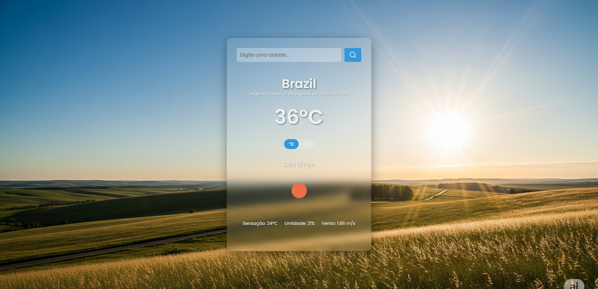
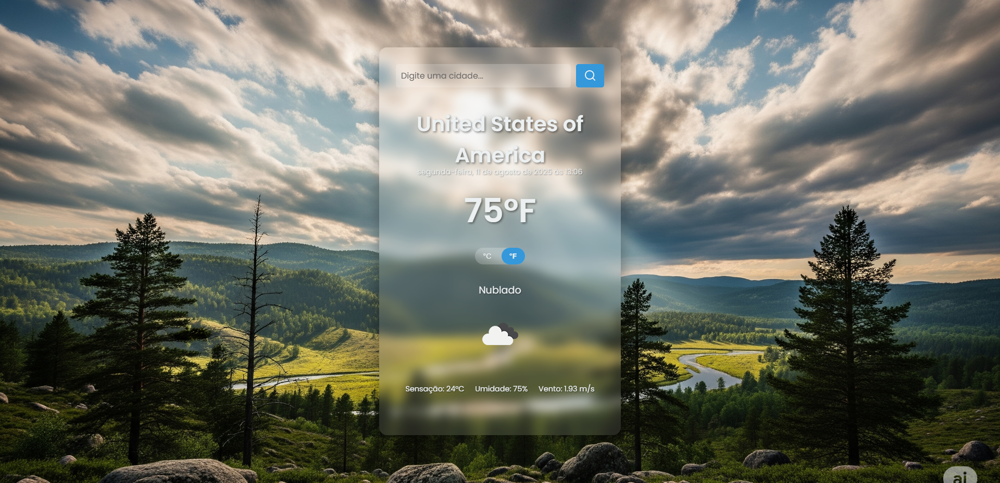

# ☀️ ✨ Previsão do Tempo ✨ 🌧️

### ☀️ Um App de Clima com Fundo Dinâmico

Este projeto é um aplicativo de previsão do tempo moderno e elegante, desenvolvido com foco em uma experiência de usuário intuitiva. Ele exibe dados de clima em tempo real para qualquer cidade do mundo, utilizando uma API externa e adaptando dinamicamente o plano de fundo da página de acordo com as condições meteorológicas.

## 🖥️ Demonstração Visual

> **Acesse a demonstração ao vivo aqui:** [https://dynamic-sky.netlify.app/](https://dynamic-sky.netlify.app/)


Visão do site, pagina inicial.


Visão do site, destacando o cartão do clima e o plano de fundo dinâmico em relação ao Brasil.


_Visão do site, destacando o cartão do clima e o plano de fundo dinâmico em relação ao Estados Unidos da América._

## 🌟 Funcionalidades em Destaque

- **Plano de Fundo Dinâmico:** A imagem de fundo muda automaticamente para refletir as condições climáticas (sol, chuva, neve, etc.), proporcionando uma experiência visual imersiva e responsiva.
- **Dados de Clima em Tempo Real:** Conecta-se à API **OpenWeatherMap** para buscar e exibir informações atualizadas, como temperatura, umidade e velocidade do vento.
- **Alternância de Temperatura:** Permite que o usuário alterne facilmente entre as unidades de temperatura Celsius (°C) e Fahrenheit (°F).
- **Tratamento de Erros:** Exibe mensagens claras para o usuário em caso de cidade não encontrada ou falhas na conexão com a API.
- **Usabilidade Aprimorada:** O campo de busca é limpo automaticamente após a pesquisa e o texto possui uma sombra para garantir visibilidade em qualquer plano de fundo.
- **Design Responsivo:** A interface se adapta perfeitamente a diferentes tamanhos de tela, garantindo uma experiência impecável em desktops e dispositivos móveis.

## 💻 Tecnologias Utilizadas

Este projeto é **Front-end puro**, construído com as seguintes tecnologias:

- **HTML5:** Estrutura semântica e acessível.
- **CSS3:** Estilização moderna com transições suaves e layout responsivo.
- **JavaScript (ES6+):** Lógica principal do projeto, responsável por todas as funcionalidades dinâmicas, incluindo a chamada da API, manipulação do DOM e eventos de clique.
- **OpenWeatherMap API:** Serviço externo utilizado para obter os dados de previsão do tempo.

## 🚀 Como Executar o Projeto

1.  **Clone o repositório:**
    ```bash
    git clone [https://github.com/VitorPaiola/seu-repositorio.git](https://github.com/VitorPaiola/seu-repositorio.git)
    ```
2.  **Navegue até a pasta do projeto:**
    ```bash
    cd seu-repositorio
    ```
3.  **Abra o arquivo `index.html`:**
    Basta arrastar o arquivo `index.html` para o seu navegador ou usar uma extensão como "Live Server" no VS Code.

## 📁 Estrutura do Projeto

```estrutura
├── images/
│   ├── clear.png
│   ├── clouds.png
│   ├── drizzle.png
│   ├── mist.png
│   ├── paisagem.png (fundo padrão)
│   ├── rain.png
│   ├── snow.png
│   └── thunderstorm.png
├── index.html
├── script.js
└── styles.css
```

---

## 📜 Licença

Este projeto é de código aberto e está licenciado sob os termos da [Licença MIT](https://opensource.org/licenses/MIT). Sinta-se à vontade para usar e adaptar o código conforme necessário.

## 🤝 Contribuições

Contribuições são sempre bem-vindas! Se você tem sugestões de melhorias ou encontrou algum problema, sinta-se à vontade para:
1.  Fazer um **Fork** do projeto.
2.  Criar uma nova **Branch** (`git checkout -b feature/SuaSugestao`).
3.  Fazer suas alterações e **Commitar** (`git commit -m 'feat: Adiciona sua sugestao'`).
4.  Subir para a sua branch (`git push origin feature/SuaSugestao`).
5.  Abrir um **Pull Request**.

Estou ansioso para ver suas melhorias! 😃

---

<p align="center">Feito com ❤️ por <a href="https://github.com/VitorPaiola">Vitor Paiola</a></p>
